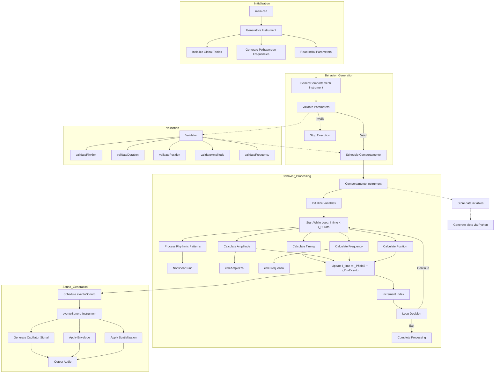

```mermaid
flowchart TB
    subgraph Initialization
        A[main.csd] --> B[Generatore Instrument]
        B --> C1[Initialize Global Tables]
        B --> C2[Generate Pythagorean Frequencies]
        B --> C3[Read Initial Parameters]
    end

    subgraph Behavior_Generation
        C3 --> D[GeneraComportamenti Instrument]
        D --> E1[Validate Parameters]
        E1 -->|Valid| E2[Schedule Comportamento]
        E1 -->|Invalid| E3[Stop Execution]
    end

    subgraph Behavior_Processing
        E2 --> F[Comportamento Instrument]
        F --> F3[Initialize Variables]
        F3 --> F4[Start While Loop: i_time < i_Durata]
        F4 --> G1[Process Rhythmic Patterns]
        F4 --> G2[Calculate Timing]
        F4 --> G3[Calculate Amplitude]
        F4 --> G4[Calculate Frequency]
        F4 --> G5[Calculate Position]
        
        G1 --> H1[NonlinearFunc]
        G3 --> H2[calcAmpiezza]
        G4 --> H3[calcFrequenza]
        
        G2 & G3 & G4 & G5 --> F5[Update i_time = i_Pfield2 + i_DurEvento]
        F5 --> F6[Increment Index]
        F6 --> F7[Loop Decision]
        F7 -->|Continue| F4
        F7 -->|Exit| F8[Complete Processing]
    end

    subgraph Sound_Generation
        F5 --> I[Schedule eventoSonoro]
        I --> J[eventoSonoro Instrument]
        J --> K1[Generate Oscillator Signal]
        J --> K2[Apply Envelope]
        J --> K3[Apply Spatialization]
        K1 & K2 & K3 --> L[Output Audio]
    end
    
    subgraph Validation
        V[Validator] --> V1[validateRhythm]
        V --> V2[validateDuration]
        V --> V3[validatePosition]
        V --> V4[validateAmplitude]
        V --> V5[validateFrequency]
        E1 -.-> V
    end
    
    %% Connect validation to behavior processing
    V -.-> E2
    
    %% Additional connections
    F -.-> F1[Store data in tables]
    F1 -.-> F2[Generate plots via Python]
```