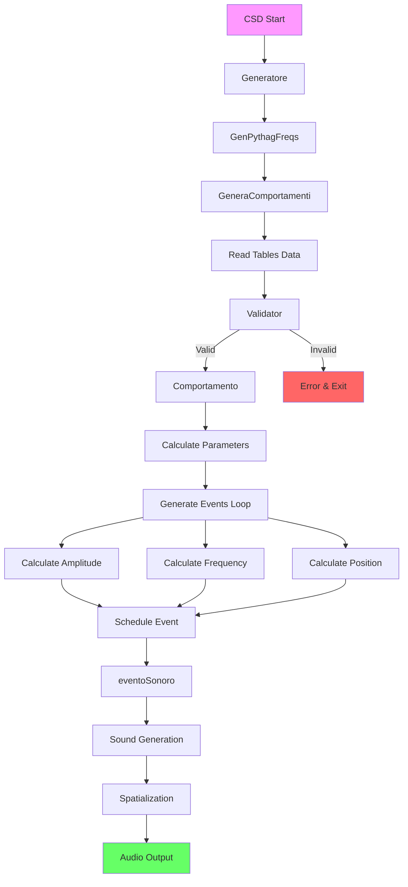

```mermaid
graph TB
    A[CSD Start] --> B[Generatore]
    B --> C[GenPythagFreqs]
    C --> D[GeneraComportamenti]
    
    D --> E[Read Tables Data]
    E --> F[Validator]
    F -->|Valid| G[Comportamento]
    F -->|Invalid| H[Error & Exit]
    
    G --> I[Calculate Parameters]
    I --> J[Generate Events Loop]
    
    J --> K[Calculate Amplitude]
    J --> L[Calculate Frequency]
    J --> M[Calculate Position]
    
    K & L & M --> N[Schedule Event]
    N --> O[eventoSonoro]
    
    O --> P[Sound Generation]
    P --> Q[Spatialization]
    Q --> R[Audio Output]
    
    style A fill:#f9f
    style H fill:#f66
    style R fill:#6f6
```