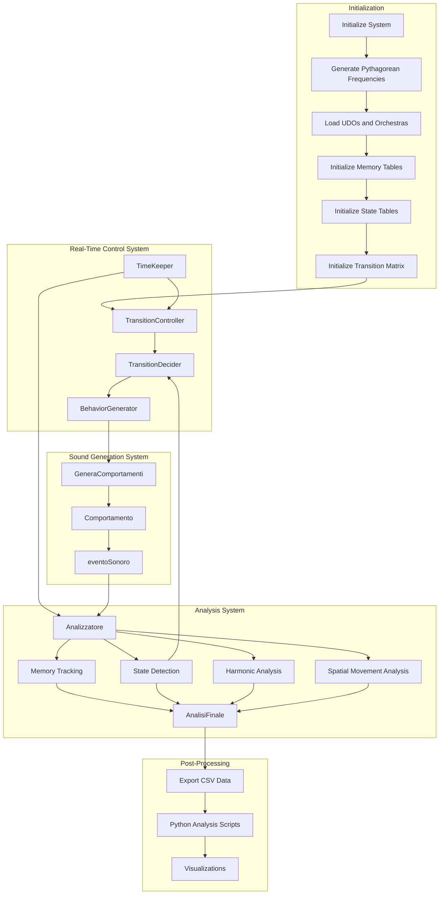

```mermaid
graph TB
    subgraph Initialization
        init[Initialize System]
        genfreq[Generate Pythagorean Frequencies]
        loadudos[Load UDOs and Orchestras]
        memtables[Initialize Memory Tables]
        statetables[Initialize State Tables]
        transprob[Initialize Transition Matrix]
    end
    
    subgraph "Real-Time Control System"
        tk[TimeKeeper]
        tc[TransitionController]
        td[TransitionDecider]
        bg[BehaviorGenerator]
    end
    
    subgraph "Sound Generation System"
        gcomp[GeneraComportamenti]
        comp[Comportamento]
        event[eventoSonoro]
    end
    
    subgraph "Analysis System"
        ana[Analizzatore]
        mem[Memory Tracking]
        state[State Detection]
        harm[Harmonic Analysis]
        spat[Spatial Movement Analysis]
        fanalisi[AnalisiFinale]
    end
    
    subgraph "Post-Processing"
        csv[Export CSV Data]
        pyscripts[Python Analysis Scripts]
        viz[Visualizations]
    end
    
    init --> genfreq
    genfreq --> loadudos
    loadudos --> memtables
    memtables --> statetables
    statetables --> transprob
    
    transprob --> tc
    tc --> td
    td --> bg
    bg --> gcomp
    
    gcomp --> comp
    comp --> event
    
    tk --> tc
    tk --> ana
    
    event --> ana
    ana --> mem
    ana --> state
    ana --> harm
    ana --> spat
    
    state --> td
    
    mem --> fanalisi
    state --> fanalisi
    harm --> fanalisi
    spat --> fanalisi
    
    fanalisi --> csv
    csv --> pyscripts
    pyscripts --> viz
```