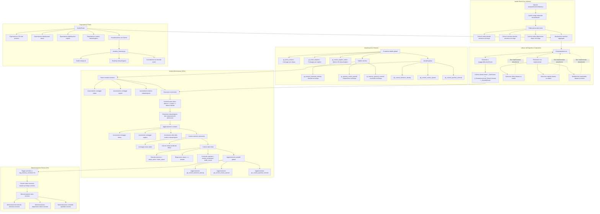

```mermaid
flowchart TD
    subgraph "Inizializzazione Sistema"
        A[Creazione tabelle globali]
        A1[gi_active_octaves - Conteggio per ottava]
        A2[gi_active_registers - Conteggio per registro]
        A3[gi_octave_register_matrix - Matrice 2D ottava/registro]
        
        A4[Tabelle storiche]
        A5[gi_memory_harmonic_density - Densità nel tempo]
        A6[gi_memory_octave_spread - Dispersione nel tempo]
        A7[gi_memory_spectral_centroid - Centroide nel tempo]
        
        A8[Variabili globali]
        A9[gk_current_harmonic_density]
        A10[gk_current_octave_spread]
        A11[gk_current_spectral_centroid]
        
        A --> A1 & A2 & A3
        A --> A4
        A4 --> A5 & A6 & A7
        A --> A8
        A8 --> A9 & A10 & A11
    end
    
    subgraph "Analisi Momentanea (10Hz)"
        B[Reset contatori armonici]
        B1[Azzeramento conteggio ottave]
        B2[Azzeramento conteggio registri]
        B3[Azzeramento matrice ottava/registro]
        
        C[Scansione eventi attivi]
        C1[Controllo stato attivo: attacco <= tempo <= attacco+durata]
        C2[Estrazione ottava/registro dal comportamento dell'evento]
        
        D[Aggiornamento contatori]
        D1[Incremento conteggio ottava]
        D2[Incremento conteggio registro]
        D3[Incremento cella nella matrice ottava/registro]
        
        E[Calcolo metriche armoniche]
        E1[Conteggio ottave attive]
        E2[Calcolo media ponderata ottave]
        
        F[Calcolo indici finali]
        F1["Densità armonica = ottave_attive / totale_ottave"]
        F2["Dispersione ottave = 1 - densità"]
        F3["Centroide spettrale = somma_ponderata / totale_eventi"]
        
        G[Aggiornamento variabili globali]
        G1[Aggiornamento gk_current_harmonic_density]
        G2[Aggiornamento gk_current_octave_spread]
        G3[Aggiornamento gk_current_spectral_centroid]
        
        B --> B1 & B2 & B3
        B --> C
        C --> C1 --> C2
        C2 --> D
        D --> D1 & D2 & D3
        D --> E
        E --> E1 & E2
        E --> F
        F --> F1 & F2 & F3
        F --> G
        G --> G1 & G2 & G3
    end
    
    subgraph "Memorizzazione Storica (1Hz)"
        H[Trigger periodico a 1/gi_memory_resolution Hz]
        H1[Calcolo indice memoria basato sul tempo corrente]
        
        I[Memorizzazione stato corrente]
        I1[Memorizzazione densità armonica corrente]
        I2[Memorizzazione dispersione ottave corrente]
        I3[Memorizzazione centroide spettrale corrente]
        
        H --> H1 --> I
        I --> I1 & I2 & I3
    end
    
    subgraph "Analisi Storica (su richiesta)"
        J[Opcode analyzeHarmonicMemory]
        J1[Calcolo range temporale da analizzare]
        
        K[Elaborazione dati storici]
        K1[Calcolo media densità armonica nel range]
        K2[Calcolo massima densità armonica nel range]
        K3[Calcolo media dispersione ottave nel range]
        
        L[Restituzione metriche aggregate]
        
        J --> J1 --> K
        K --> K1 & K2 & K3
        K --> L
    end
    
    subgraph "Utilizzo nell'Algoritmo Compositivo"
        M[Comportamento.orc]
        M1[Chiamata a sugggestDurationFactor]
        M2["Calcolo durata evento: i_DurEvento = (i_DurataArmonica/i_RitmoCorrente) * i_OverlapFactor"]
        
        N[Potenziale non implementato]
        N1[Selezione ottava basata su analisi]
        N2[Selezione registro basata su analisi]
        N3[Modulazione amplitudine basata su analisi]
        
        M --> M1 --> M2
        M --> N
        N --> N1 & N2 & N3
        N1 & N2 & N3 -. "Non implementato attualmente" .-> M
    end
    
    subgraph "Esportazione Finale"
        P[AnalisiFinale]
        P1[Esportazione CSV dati armonici]
        P2[Esportazione distribuzione ottave]
        P3[Esportazione distribuzione registri]
        P4[Esportazione matrice ottava/registro]
        
        Q[Visualizzazione con Python]
        Q1[visualize_harmony.py]
        Q2[Grafici temporali]
        Q3[Heatmap ottava/registro]
        Q4[Correlazione con densità eventi]
        
        P --> P1 & P2 & P3 & P4
        P --> Q
        Q --> Q1
        Q1 --> Q2 & Q3 & Q4
    end
    
    %% Collegamenti tra sezioni
    A8 --> B
    G --> H
    L --> M
    M2 --> C
    P --> L
```