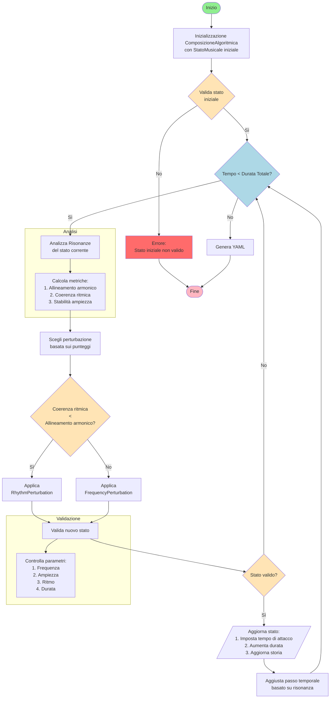

```mermaid
flowchart TD
    Start([Inizio]) --> Init[Inizializzazione ComposizioneAlgoritmica<br>con StatoMusicale iniziale]
    
    Init --> ValidateInit{Valida stato<br>iniziale}
    ValidateInit -->|No| Error[Errore:<br>Stato iniziale non valido]
    Error --> End([Fine])
    
    ValidateInit -->|Sì| MainLoop{Tempo < Durata Totale?}
    MainLoop -->|No| Export[Genera YAML]
    Export --> End
    
    MainLoop -->|Sì| AnalyzeRes[Analizza Risonanze<br>del stato corrente]
    
    subgraph Analisi
    AnalyzeRes --> CalcMetrics[Calcola metriche:<br>1. Allineamento armonico<br>2. Coerenza ritmica<br>3. Stabilità ampiezza]
    end
    
    CalcMetrics --> ChoosePert[Scegli perturbazione<br>basata sui punteggi]
    
    ChoosePert --> Decision{Coerenza ritmica <br>< <br>Allineamento armonico?}
    Decision -->|Sì| RhythmPert[Applica<br>RhythmPerturbation]
    Decision -->|No| FreqPert[Applica<br>FrequencyPerturbation]
    
    RhythmPert --> Validate[Valida nuovo stato]
    FreqPert --> Validate
    
    Validate --> IsValid{Stato valido?}
    IsValid -->|No| MainLoop
    
    IsValid -->|Sì| Update[/Aggiorna stato:<br>1. Imposta tempo di attacco<br>2. Aumenta durata<br>3. Aggiorna storia/]
    
    Update --> AdjustTime[Aggiusta passo temporale<br>basato su risonanza]
    AdjustTime --> MainLoop
    
    subgraph Validazione
    Validate --> CheckParams[Controlla parametri:<br>1. Frequenza<br>2. Ampiezza<br>3. Ritmo<br>4. Durata]
    end

    style Start fill:#90EE90
    style End fill:#FFB6C1
    style MainLoop fill:#ADD8E6
    style Decision fill:#FFE4B5
    style IsValid fill:#FFE4B5
    style ValidateInit fill:#FFE4B5
    style Error fill:#FF6B6B
```
