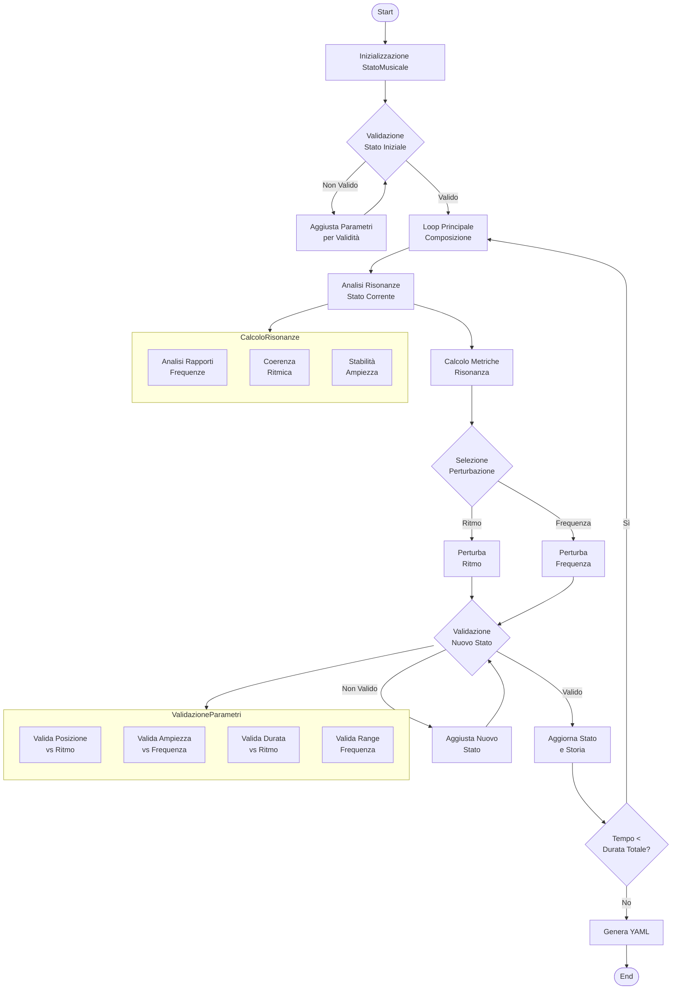

```mermaid
flowchart TB
    Start([Start]) --> Init[Inizializzazione StatoMusicale]
    Init --> ValidateInit{Validazione\nStato Iniziale}
    
    ValidateInit -->|Non Valido| AdjustState[Aggiusta Parametri\nper Validità]
    AdjustState --> ValidateInit
    
    ValidateInit -->|Valido| MainLoop[Loop Principale\nComposizione]
    
    MainLoop --> Analysis[Analisi Risonanze\nStato Corrente]
    Analysis --> CalcMetrics[Calcolo Metriche\nRisonanza]
    
    CalcMetrics --> SelectPert{Selezione\nPerturbazione}
    SelectPert -->|Ritmo| PertRhythm[Perturba\nRitmo]
    SelectPert -->|Frequenza| PertFreq[Perturba\nFrequenza]
    
    PertRhythm --> ValidateNew{Validazione\nNuovo Stato}
    PertFreq --> ValidateNew
    
    ValidateNew -->|Non Valido| AdjustNew[Aggiusta Nuovo\nStato]
    AdjustNew --> ValidateNew
    
    ValidateNew -->|Valido| UpdateState[Aggiorna Stato\ne Storia]
    
    UpdateState --> CheckTime{Tempo < \nDurata Totale?}
    CheckTime -->|Sì| MainLoop
    CheckTime -->|No| GenerateYAML[Genera YAML]
    
    GenerateYAML --> End([End])
    
    subgraph ValidazioneParametri
        direction TB
        vCheck1[Valida Posizione\nvs Ritmo]
        vCheck2[Valida Ampiezza\nvs Frequenza]
        vCheck3[Valida Durata\nvs Ritmo]
        vCheck4[Valida Range\nFrequenza]
    end
    
    subgraph CalcoloRisonanze
        direction TB
        rCalc1[Analisi Rapporti\nFrequenze]
        rCalc2[Coerenza\nRitmica]
        rCalc3[Stabilità\nAmpiezza]
    end
    
    ValidateNew --> ValidazioneParametri
    Analysis --> CalcoloRisonanze

```