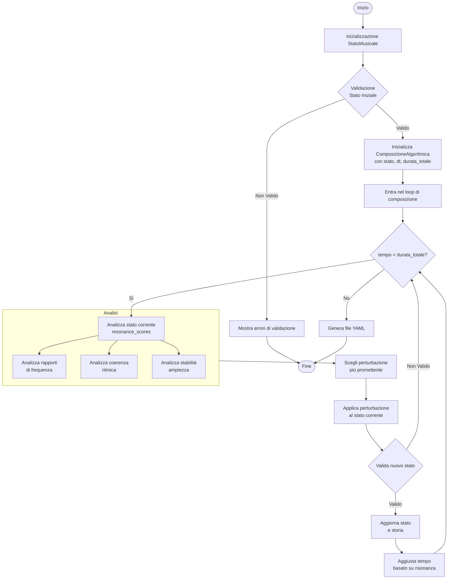

```mermaid
flowchart TD
    Start([Inizio]) --> Init[Inizializzazione StatoMusicale]
    Init --> ValidateInit{Validazione\nStato Iniziale}
    ValidateInit -- Valido --> CompInit[Inizializza ComposizioneAlgoritmica\ncon stato, dt, durata_totale]
    ValidateInit -- Non Valido --> ErrorInit[Mostra errori di validazione]
    ErrorInit --> End([Fine])
    
    CompInit --> CompLoop[Entra nel loop di composizione]
    CompLoop --> CheckTime{tempo < durata_totale?}
    CheckTime -- No --> GenYAML[Genera file YAML]
    CheckTime -- Sì --> AnalyzeState[Analizza stato corrente\nresonance_scores]

    subgraph Analisi
        AnalyzeState --> AnalyzeFreq[Analizza rapporti\ndi frequenza]
        AnalyzeState --> AnalyzeRhythm[Analizza coerenza\nritmica]
        AnalyzeState --> AnalyzeAmp[Analizza stabilità\nampiezza]
    end

    Analisi --> ChoosePert[Scegli perturbazione\npiù promettente]
    ChoosePert --> ApplyPert[Applica perturbazione\nal stato corrente]
    ApplyPert --> ValidateNew{Valida nuovo stato}

    ValidateNew -- Valido --> UpdateState[Aggiorna stato\ne storia]
    UpdateState --> AdjustTime[Aggiusta tempo\nbasato su risonanza]
    AdjustTime --> CheckTime

    ValidateNew -- Non Valido --> CheckTime

    GenYAML --> End
```