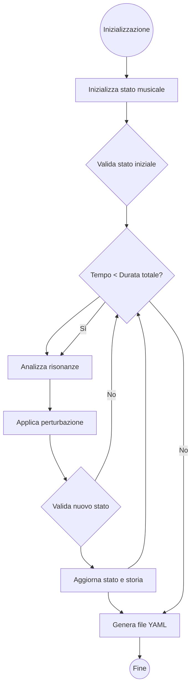

```mermaid
flowchart TD
    N1((Inizializzazione))
    N2["Inizializza stato musicale"]
    N1 --> N2
    N3{Valida stato iniziale}
    N2 --> N3
    N4{Tempo < Durata totale?}
    N3 --> N4
    N5["Analizza risonanze"]
    N4 --> N5
    N6["Applica perturbazione"]
    N5 --> N6
    N7{Valida nuovo stato}
    N6 --> N7
    N8["Aggiorna stato e storia"]
    N7 --> N8
    N9["Genera file YAML"]
    N8 --> N9
    N10((Fine))
    N9 --> N10
    N4 -->|Sì| N5
    N4 -->|No| N9
    N7 -->|No| N4
    N8 --> N4
```